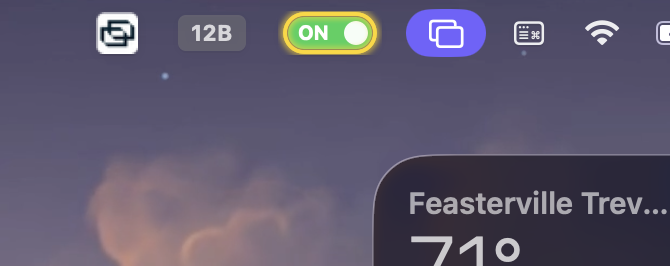
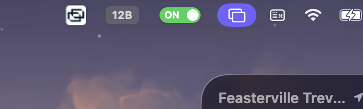

# AllNighter

A tiny macOS menu-bar app that lets your Mac pull an all-nighter — no sleeping,
even **with the lid closed** — driven by a pill-shaped toggle and a loopback HTTP API.



## Two independent modes

| Mode | What it does | How to toggle |
|------|--------------|---------------|
| **Display keep-awake** | Runs `caffeinate -d -i` — blocks display sleep *and* idle system sleep. Screen stays on. Lid-close still sleeps. | **Left-click** the pill |
| **Closed-lid keep-alive** | Sets `pmset disablesleep` — the Mac keeps running even with the **lid closed** (the screen may turn off, but the system won't sleep). | **Right-click** → *Keep awake with lid closed* |

The pill shows state at a glance — and gains a **yellow glowing ring** whenever
closed-lid keep-alive is on (over the green *or* gray pill):

| Pill | Meaning |
|------|---------|
|  | display keep-awake **off** |
|  | display keep-awake **on** |
|  | **on** + closed-lid keep-alive (ring) |

## Why a second mode?

`caffeinate` only blocks *idle* sleep — it can't stop the **clamshell (lid-close)
sleep** macOS forces when you shut the lid. The only thing that does is
`pmset disablesleep 1`, which needs root. AllNighter handles that with a
**one-time** admin prompt that installs a minimal, `visudo`-validated sudoers rule
(allowing only `pmset -a disablesleep 0|1`); after that, toggling — and the
automatic revert — are silent.

**Safety:** `disablesleep` is reverted to `0` when you turn the mode off, when the
app quits, and on `SIGTERM`/`SIGINT`. The state is persisted and re-asserted (or
cleared) at launch, so a crash can't strand your Mac unable to sleep. There is
**no** AC-only gating — enable it on battery, close the lid, and walk away, and the
Mac stays awake and drains (same trade-off as Amphetamine's closed-display mode).

## Install

Requires macOS 11+ and the Xcode Command Line Tools (`xcode-select --install`).

```bash
git clone https://github.com/BlinkingSun/AllNighter.git
cd AllNighter
./install.sh
```

This builds `AllNighter.app`, copies it to `~/Applications`, and installs a
login-item LaunchAgent so it starts automatically and stays running. Prefer a
pre-built, code-signed & notarized `.app`? Grab it from the
[latest release](https://github.com/BlinkingSun/AllNighter/releases).

## HTTP API

AllNighter serves a tiny JSON API bound to **127.0.0.1 only** (loopback — not
reachable from the network) so scripts and local agents can read/change state.

Base URL: `http://127.0.0.1:17893`

| Method | Path | Effect | Response |
|--------|------|--------|----------|
| GET | `/status` | Read both modes | `{"state":"on\|off","closedLid":"on\|off"}` |
| POST | `/on` · `/off` · `/toggle` | Display keep-awake | `{"state":"on\|off"}` |
| POST | `/lid/on` · `/lid/off` · `/lid/toggle` | Closed-lid keep-alive | `{"closedLid":"on\|off"}` |

`GET` is accepted on the mutating routes too, for convenience.

```bash
curl -s http://127.0.0.1:17893/status
curl -s -X POST http://127.0.0.1:17893/on
curl -s -X POST http://127.0.0.1:17893/lid/on
```

> The first time closed-lid mode is enabled (via menu or HTTP) macOS shows a
> one-time admin prompt. If nobody answers it, the enable is a no-op.

## Build from source

```bash
swift build -c release        # bare binary → .build/release/AllNighter
./scripts/build-app.sh        # assemble dist/AllNighter.app
```

Want to see the pill without touching your menu bar? `AllNighter --preview` renders
each state to `/tmp/allnighter-icon-*.png`.

## Uninstall

```bash
launchctl bootout "gui/$(id -u)/com.allnighter.mac"
rm -f ~/Library/LaunchAgents/com.allnighter.mac.plist
rm -rf ~/Applications/AllNighter.app
sudo rm -f /etc/sudoers.d/allnighter-pmset   # only if you used closed-lid mode
```

## License

MIT © 2026 BlinkingSun. See [LICENSE](LICENSE).
